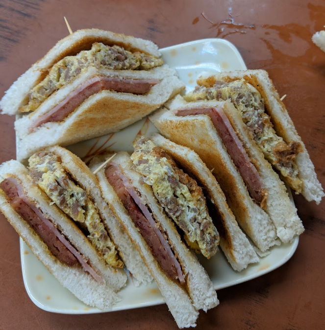
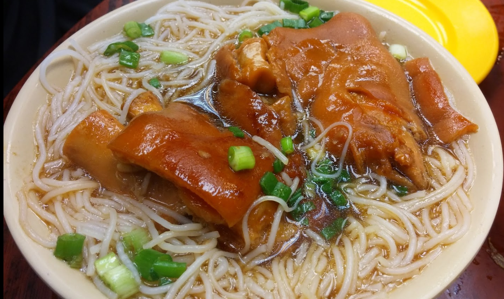

홍콩 여행
=============

미리 알아야 할 것
---
- 옥토버스 카드
  - 구매
    'train ticket to the city' or 'Train tickets'  
      39HKD + 최소 충전금액 100HKD = 150HKD(약 이만 3천원)  
      홍콩역에 도착하면 먼저 옥토버스 카드부터 구매하자  
      버스, 트램도 사용이 가능하다  
- 짐보관 서비스
  - 각종 MTR에서 짐보관 서비스를 진행하고 있다.
    짐 1개당 57 홍콩달러(8500원 정도)

일정
---
- 일정
  - 23일 일정  
    >공항에서 1시정도에 ~~짐 찾고~~ 내려서  
    호텔 도착전 점심을 먹을 예정  
    식당이름 : Mon Kee Cafe - Tsim Sha Tsui
    위치  : 29-39 Ashley Road G/F, Kowloon Centre, Hong Kong China  
    <a href="https://www.tripadvisor.com/Restaurant_Review-g294217-d15012918-Reviews-Mon_Kee_Cafe_Tsim_Sha_Tsui-Hong_Kong.html" title="식당링크로 이동">점심집 링크</a> <a href="" title="구글 지도로 이동">구글 지도로 이동</a>
      
      
    호텔에 3시정도에 도착할 예정  
    짐을 푼 이후 미드레벨 에스컬레이터 타기  (호텔 -> 미드레벨 30분 정도)  
    미드레벨에서 홍콩 공원까지 걸어가다가 중간에 저녁 먹기  
    식당 이름 : Ding Dim
    위치 : 59 Wyndham St, Central, Hong Kong  
    <a href="https://www.google.com/maps/place/%E9%BC%8E%E9%BB%9E+Ding+Dim+1968/@22.2812819,114.1527044,17z/data=!3m1!4b1!4m5!3m4!1s0x3404007ba30c7d1d:0x52024f1b717847d9!8m2!3d22.2812819!4d114.1548931" title="딤섬집">딤섬집 지도 링크</a>
    딤섬집 가는 길에 영웅본색 영화 오프닝 촬영 장소가 있으니 가보면 좋을 것 같다.
    황후상 공원
    위치 : Des Voeux Rd Central, Central, Hong Kong

    <!--~~홍콩 공원 근처에 Tram View Cafe(4.1) 카페로 가서 커피를 사들고 공원 산책을 하다가    
    지도 : 2 Tramway Path, Mid-Levels, Hong Kong <a href="https://www.google.com/maps/place/Tram+View+Cafe/@22.2771945,114.158378,18.82z/data=!4m8!1m2!2m1!1sCoffee!3m4!1s0x0:0xdd3766c0fb9339f6!8m2!3d22.2767278!4d114.1582804">지도 링크</a>  
    트램을 타려고 했으나 트램 대기줄이 길면 1시간도 기다린다고 해서 버스를 타고 가기로 결정  
    홍콩 공원에서 커피타임을 가진 후 <a href="https://www.google.com/maps/place/Bank+of+China+Tower/@22.2780419,114.1597656,17.56z/data=!4m8!1m2!2m1!1s15+bus+stop!3m4!1s0x3404006680ab28c9:0xe815e7aaaef62657!8m2!3d22.2794773!4d114.1621401!5m1!1e2">Bank of China Tower</a>에 가서 15번 버스를 타고 야경을 구경  
    (버스에서 내려서 20분정도 걸어야 해서 홍콩공원을 생략해도 좋을거 같아요)  
    (버스를 잡기 위해 계획 수정 가능성 O)~~-->

    > 15번 버스 5번 부두에서 타서 빅토리아 피크에서 내려서 간다.
    멋진 야경을 보면서 사랑을 나눈다.
    칵테일 바 : Buenos Aires Polo Club
    위치 : Hong Kong, Wyndham St, 33號LKF Tower7th Floor
    
    
    칵테일 바 2 : the old man
    위치 : Lower G/F, 37-39 Aberdeen Street, Soho, Central, Hong Kong, Hong Kong
    
    두 칵테일 바 위치는 비슷하다.

  - 24일 일정
    > 아침 메뉴
    미도 카페 아침 9시부터 오픈
    63 Temple St, Yau Ma Tei, Hong Kong
    미도카페에서 맛있는 아침을 먹거나 전날 베이커리에서 산 스콘을 호텔에서 밀크티와 함께 먹는다.
    그리고 Tai Koo Station 에 가서 Passion by Gerard Dubois 이 있으니까 거기서 빵을 사서 들고 가면 맛나게 먹을 수 있을거 같다.
    아니면 길거리 샌드위치집에서 포장해서 먹어도 좋을
    그리고 걸어서 18분정도 걸으면 Shau kei wan station 에 도착한다.
    A3번 출구 로 가면 맨 오른쪽에서 3번째 라인에 9번 버스가 있다.
    거기서 버스를 탄다
    
    Cape Collinson; Shek O Road 에서 내린다.
    
    역 도착하기 전에 벨을 누르고 1층 문앞에 가 있어야 한다.
     버스 진행방향으로 가면 이런 계단이 나오는데 이 계단을 따라 올라가면 된다.
    드래곤스 백 으로 따라서 게속 올라가고 TO SHEK O PEAK를 따라 가면 정상으로 올라갈 수 있다.
    정상에서 맛있는 빵 먹고 섹오비치로 내려간다.
    섹오비치에서 배가 고프다면 Happy Garden 으로 간다.
    위치 : G/F, 786 Shek O Village, Shek O, Hong Kong
    
    
    후기를 보면 맛도 괜찮고 양도 많은 태국식 음식점이라고 한다.
    즐거운 트레킹을 마치고 난 이후 케이크와 딤섬을 사서 호텔로 돌아간다.

- 맛집
  - Sun Heung Yuen (Kin Kee)
    시간 : 24시간 영업
    위치 : 38號 Kweilin St, Sham Shui Po, Hong Kong
    침사추이 북쪽지역에 있다.
    
    

  - Dim Dim Sum - Wan Chai(딤섬 맛집)
    시간 : 10AM ~ 12AM
    위치 : 7 Tin Lok Lane, Wan Chai, Hong Kong
    딤섬 프랜차이즈같은데 유명한가 봄, 완차이 지역, 2일차 트레킹 이후 포장해가도 좋을듯

  - Lan Fong Yuen (토스트)
    시간 : 오전 10시 30분 ~
    위치 : 청킹맨션 내부
    (44 Nathan Rd, Tsim Sha Tsui, Hong Kong)
    가격은 현지 식당이라 저렴하다 함
    한국인들한테 연유토스트가 유명해서 연유토스트를 많이 먹는다고 하지만 대부분 맛있다고 함

  - The Mandarin Cake Shop (센트럴 베이커리 맛집)
    위치 : 5 Connaught Road Central 5 Connaught Road Central, 홍콩 중국  
    
    센트럴에 있어서 첫날에 사도 좋을거 같다. 스콘이 맛있고 한국엔 장미잼이 유명하다고 알려졌다.
  - Passion by Gerard Dubois (완차이 베이커리)
    위치 : Shop 1, G/F Fraser Suites, 74-78 Johnston Road, Wan Chai, 홍콩 중국
    8시부 시작하고 센트럴, 완차이, 침사추이 다 있는 프랜차이즈 인듯
    여기도 여기저기에 있는 베이커리, 24일에 트레킹 가기 전에 들를수 있 위치에 있다. 빵을 사서 가방에 넣어서 가지고 다니면 좋을듯?
    
  - Hang Heung (중국식 베이커리)
    위치 : Hong Kong, Causeway Bay, Hennessy Rd, 555號, 21 Irving Street, 崇光百貨B2
    
